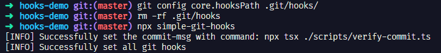

# 更轻量级的 git hooks 方案

在参与开源项目 [Earthworm](https://earthworm.cuixueshe.com/) 开发过程中，认领了一个 issue 任务，添加 commit 规范&检查&生成 changelog，参见 https://github.com/cuixueshe/earthworm/issues/89

当时给出的实现还是基于 husky 作为 git hooks 方案，但是相较于本文介绍的 simple-git-hooks，体量上不够轻量。

## simple-git-hooks

官网地址：https://github.com/toplenboren/simple-git-hooks

它给出的包体量比较，如下，可见 simple-git-hooks 真的很小。


## Usage

新建一个项目 hooks-demo，进入项目，执行 pnpm 初始化操作生成 package.json

```shell
pnpm init
```


安装 simple-git-hooks 等依赖，

```shell
pnpm add simple-git-hooks -D
pnpm add typescript -D
pnpm add @types/node -D
pnpm add tsx -D
```


package.json 添加 simple-git-hooks 字段，触发 git hooks，

```json
"simple-git-hooks": {
"commit-msg": "npx tsx ./scripts/verify-commit.ts"
},
```


在 commit-msg 钩子中执行，scripts 文件夹下的 verify-commit 文件。依目录新建，verify-commit.ts 代码如下：

```ts
import pico from "picocolors";
import { readFileSync } from "node:fs";
import path from "node:path";

const msgPath = path.resolve(".git/COMMIT_EDITMSG");
const msg = readFileSync(msgPath, "utf-8").trim();

const commitRE =
  /^(revert: )?(feat|fix|docs|dx|style|refactor|perf|test|workflow|build|ci|chore|types|wip|release)(\(.+\))?: .{1,50}/;

if (!commitRE.test(msg)) {
  console.log(pico.yellow(`\n你提交的信息: ${msg}\n`));
  console.error(
    `${pico.white(pico.bgRed(" 错误 "))} ${pico.red(
      `无效的提交信息格式.`
    )}\n\n` +
      pico.red(`  正确的提交消息格式. 例如:\n\n`) +
      `    ${pico.green(`feat: add a new feature`)}\n` +
      `    ${pico.green(`fix: fixed an interaction bug`)}\n\n` +
      pico.red(
        `我们参考了Vue3的方案.\n` +
          `访问 https://github.com/vuejs/core/blob/main/.github/commit-convention.md 查看更多细节.\n`
      )
  );
  process.exit(1);
}
```

以上代码，使用了 picocolors，这个库用于在终端进行颜色标注的输出格式化。需要下载安装一下，

```shell
pnpm add picocolors -D
```

通过 `node:path` 读取文件 .git/COMMIT_EDITMSG，从中可以获取 git commit 信息，但是此时我们的 demo 项目还没有初始化 `git init`，也没有进行远程仓库的映射。这部操作网上教程很多，简单说一下，github 上新建一个仓库，拿到这个仓库的地址，在本地仓库下执行 `git remote add` 进行映射。

其中 commitRE 是正则表达式，用于匹配符合一定规则的提交消息，具体解释如下：

- ^：表示匹配字符串的开头。
- (revert: )?：这是一个可选部分，匹配以 "revert: " 开头的字符串，表示回滚提交。
- (feat|fix|docs|dx|style|refactor|perf|test|workflow|build|ci|chore|types|wip|release)：这是一个捕获组，它匹配以下单词中的任意一个：
  - feat：表示新增功能。
  - fix：表示修复 bug。
  - docs：表示更新文档。
  - dx：表示改进开发者体验。
  - style：表示修改样式。
  - refactor：表示重构代码。
  - perf：表示性能优化。
  - test：表示添加或修改测试。
  - workflow：表示改进工作流程。
  - build：表示修改构建系统或外部依赖。
  - ci：表示修改持续集成配置文件或脚本。
  - chore：表示其他杂项任务。
  - types：表示修改类型定义文件（如 TypeScript）。
  - wip：表示进行中的工作，尚未完成。
  - release：表示发布新版本。
  - (\(.+\))?：这是一个可选部分，匹配括号中的内容，表示作用域或影响范围。括号内的内容可以是任意字符。
- :：表示冒号，用于分隔提交类型和提交说明。
- .{1,50}：表示匹配任意字符，长度在 1 到 50 之间，表示提交说明的文本内容。
  如果你的 commit 提交信息不正确，就会给出下列的错误提示，这儿完全可以自定义你想在终端输出的内容。

## Test

最后我们来测试一下，按照不合法的 commit msg 进行提交，commit 之后查看终端显示，


发现 commit 信息并不合法，但是还是成功提交，说明我们配置的 git-hooks 没有生效。

执行如下操作：

```shell
# [Optional] These 2 steps can be skipped for non-husky users
git config core.hooksPath .git/hooks/
rm -rf .git/hooks

# Update ./git/hooks
npx simple-git-hooks
```



撤销上次的提交，再次验证，


终端成功显示出，scripts/verify-commit.ts 中自定义的报错内容。至此，simple-git-hooks 使用成功。
